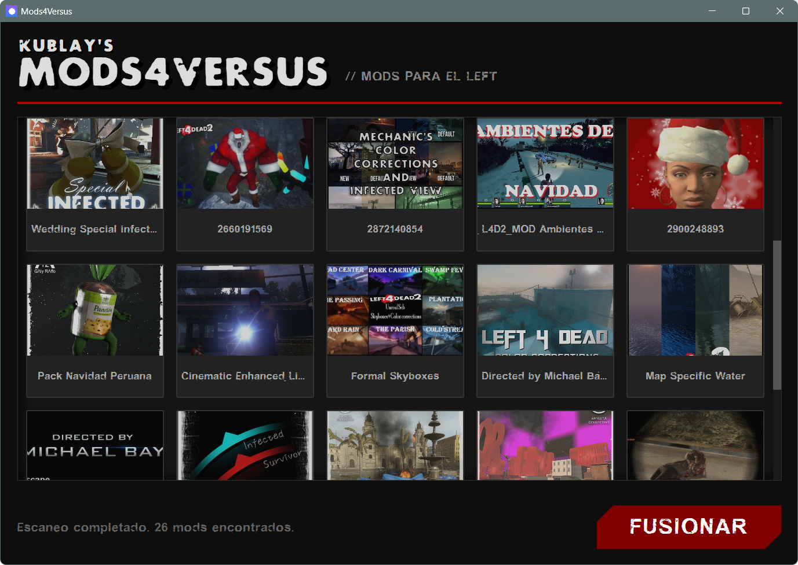
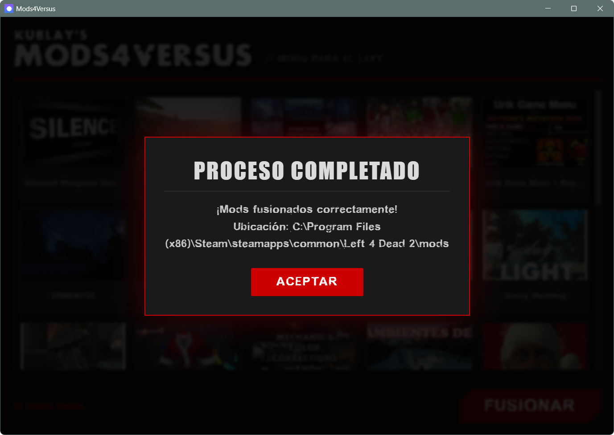

# 🧟 Mods4Versus

**Native Left 4 Dead 2 VPK Merger & Mod Manager**

*Play your favorite Workshop mods in Versus mode without file conflicts. Automatically merges VPKs and patches game configurations—no external tools needed.*

---
## 📸 Screenshots

   
  
    
  
  

    
    &nbsp; &nbsp;
    
  

## 📥 Download

| Version | Description | Link |
|---------|-------------|--------|
| **latest (v1.2.1)** | Auto-Updating Windows Setup | [⬇️ Download Installer](https://github.com/kublay-tayro/Mods4Versus/releases/download/v1.2.1/Mods4Versus_1.2.1_x64-setup.exe) |

---

## ✨ Key Features

- 🚀 **Native Performance** — Built with **Rust** and **Tauri v2** for minimal resource usage.
- 📦 **VPK Merging** — Combines multiple add-ons into a single optimized file to bypass server consistency checks.
- 🔄 **Auto-Configuration** — Automatically detects your L4D2 installation and patches the environment.
- ⚡ **Real-Time Streaming** — Instant visual feedback as mods are scanned and loaded.
- 🖼️ **Visual Preview** — View thumbnails and metadata for every mod before merging.

---

## 🎮 How to Use

1. **Launch** — The app automatically scans your Steam Workshop folder.
2. **Select** — Click on the mods you want to enable for Versus.
3. **Merge** — Hit the "MERGE" button.
4. **Play** — The tool places the merged VPK into your `mods/` folder and updates `gameinfo.txt`.

> 💡 **Note:** Mods4Versus handles the `gameinfo.txt` injection automatically. You do not need to edit any text files manually.

---

## 🔧 Tech Stack

| Component | Technology |
|------------|------------|
| Framework | [Tauri v2](https://v2.tauri.app/) |
| Core Logic | Rust |
| Frontend | HTML5, CSS3, JavaScript |
| VPK Parsing | Custom implementation + [valve_pak](https://crates.io/crates/valve_pak) |
| Path Detection | [steamlocate](https://crates.io/crates/steamlocate) |

---

## 📝 License

This project is open-source under the **GNU GPLv3** license. Contributions are welcome! 

Please read our [CONTRIBUTING.md](./CONTRIBUTING.md).

---

*Crafted for the Left 4 Dead 2 Community*

